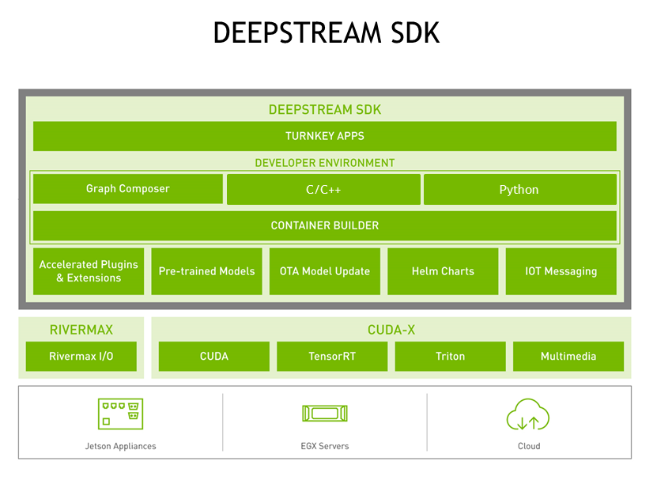

# SurveillanceAI

> A surveillance system that uses AI with DeepStream Backend

## DeepStream Development Environment

### Refer docker/deepstream-dev.Dockerfile

<p align="center">
  
</p>

## Future work

- [ ] Deepstream Support
- [ ] Triton Server Support
- [ ] OpenVINO Model Server Support

### Build the container

```bash
docker build -t deepstream:dev -f deepstream-dev.Dockerfile ../
```

### Run the container

```bash
xhost +SI:localuser:root
```

```bash
docker run --network=bridge --ipc=host --ulimit memlock=-1 --ulimit stack=67108864 --gpus all -it -v /tmp/.X11-unix:/tmp/.X11-unix -e DISPLAY=$DISPLAY --privileged -v /var/run/docker.sock:/var/run/docker.sock -v ./workspace/SurveillanceAI:/workspace/SurveillanceAI -p 2222:22 -p 8001:8000 -p 8554:8554 -p 9001:9001 deepstream:dev
```

```bash
composer # to start the graph-composer
```

### Start RTSP Server:

```bash
cvlc v4l2:///dev/video0 --sout '#transcode{vcodec=h264,acodec=mpga,ab=128,channels=2,samplerate=44100}:rtp{sdp=rtsp://192.168.1.10:8554/}'
```

## HELP

```
Refer https://docs.nvidia.com/metropolis/deepstream/dev-guide/text/DS_Overview.html
```

## Business Requirements

```
Refer Devices ~ https://docs.nvidia.com/metropolis/deepstream/dev-guide/text/DS_Performance.html
```
```
Refer License ~ https://developer.download.nvidia.com/assets/Deepstream/LicenseAgreement-NGC_6.1.pdf
```