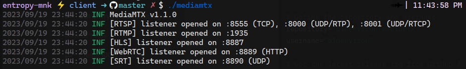

## Library : MEDIAMTXv1.1.0

1. client folder contain the mediamtx executable & config file
   Install the stable version of MEDIAMTX
   ```bash
   sh mediamtx_download.sh
   ```

2. Start the mediamtx & after editing you configuration in mediamtx.yml
   ```bash
   ./mediamtx
   ```

<p align="center">
  
</p>

3. Refer respective usages below


## Usage

1. Publish a stream. For instance, you can publish a video/audio file with _FFmpeg_:

   ```sh
   ffmpeg -re -stream_loop -1 -i file.ts -c copy -f rtsp rtsp://localhost:8554/mystream
   ```

   or _GStreamer_:

   ```sh
   gst-launch-1.0 rtspclientsink name=s location=rtsp://localhost:8554/mystream filesrc location=file.mp4 \
   ! qtdemux name=d d.video_0 ! queue ! s.sink_0 d.audio_0 ! queue ! s.sink_1
   ```

2. Open the stream. For instance, you can open the stream with _VLC_:

   ```sh
   vlc --network-caching=50 rtsp://localhost:8554/mystream
   ```

   or _GStreamer_:

   ```sh
   gst-play-1.0 rtsp://localhost:8554/mystream
   ```

   or _FFmpeg_:

   ```sh
   ffmpeg -i rtsp://localhost:8554/mystream -c copy output.mp4
   ```

## Publish to the server

### By software

#### FFmpeg

FFmpeg can publish a stream to the server in multiple ways (SRT client, SRT server, RTSP client, RTMP client, UDP/MPEG-TS, WebRTC with WHIP). The recommended one consists in publishing as a [RTSP client](#rtsp-clients):

```
ffmpeg -re -stream_loop -1 -i file.ts -c copy -f rtsp rtsp://localhost:8554/mystream
```

The RTSP protocol supports multiple underlying transport protocols, each with its own characteristics (see [RTSP-specific features](#rtsp-specific-features)). You can set the transport protocol by using the `rtsp_transport` flag, for instance, in order to use TCP:

```sh
ffmpeg -re -stream_loop -1 -i file.ts -c copy -f rtsp -rtsp_transport tcp rtsp://localhost:8554/mystream
```

The resulting stream will be available in path `/mystream`.

#### GStreamer

GStreamer can publish a stream to the server in multiple ways (SRT client, SRT server, RTSP client, RTMP client, UDP/MPEG-TS, WebRTC with WHIP). The recommended one consists in publishing as a [RTSP client](#rtsp-clients):

```sh
gst-launch-1.0 rtspclientsink name=s location=rtsp://localhost:8554/mystream \
filesrc location=file.mp4 ! qtdemux name=d \
d.video_0 ! queue ! s.sink_0 \
d.audio_0 ! queue ! s.sink_1
```

If the stream is video only:

```sh
gst-launch-1.0 filesrc location=file.mp4 ! qtdemux name=d \
d.video_0 ! rtspclientsink location=rtsp://localhost:8554/mystream
```

The RTSP protocol supports multiple underlying transport protocols, each with its own characteristics (see [RTSP-specific features](#rtsp-specific-features)). You can set the transport protocol by using the `protocols` flag:

```sh
gst-launch-1.0 filesrc location=file.mp4 ! qtdemux name=d \
d.video_0 ! rtspclientsink protocols=tcp name=s location=rtsp://localhost:8554/mystream
```

The resulting stream will be available in path `/mystream`.

#### OBS Studio

OBS Studio can publish to the server in multiple ways (SRT client, RTMP client, WebRTC client). The recommended one consists in publishing as a [RTMP client](#rtmp-clients). In `Settings -> Stream` (or in the Auto-configuration Wizard), use the following parameters:

* Service: `Custom...`
* Server: `rtmp://localhost`
* Stream key: `mystream`

If credentials are in use, use the following parameters:

* Service: `Custom...`
* Server: `rtmp://localhost`
* Stream key: `mystream?user=myuser&pass=mypass`

Save the configuration and click `Start streaming`.

If you want to generate a stream that can be read with WebRTC, open `Settings -> Output -> Recording` and use the following parameters:

* FFmpeg output type: `Output to URL`
* File path or URL: `rtsp://localhost:8554/mystream`
* Container format: `rtsp`
* Check `show all codecs (even if potentically incompatible`
* Video encoder: `h264_nvenc (libx264)`
* Video encoder settings (if any): `bf=0`
* Audio track: `1`
* Audio encoder: `libopus`

Then use the button `Start Recording` (instead of `Start Streaming`) to start streaming.

Latest versions of OBS Studio can publish to the server with the [WebRTC / WHIP protocol](#webrtc). Use the following parameters:

* Service: `WHIP`
* Server: `http://localhost:8889/mystream/whip`

Save the configuration and click `Start streaming`.

The resulting stream will be available in path `/mystream`.

#### OpenCV

OpenCV can publish to the server through its GStreamer plugin, as a [RTSP client](#rtsp-clients). It must be compiled with GStreamer support, by following this procedure:

```sh
sudo apt install -y libgstreamer1.0-dev libgstreamer-plugins-base1.0-dev gstreamer1.0-plugins-ugly gstreamer1.0-rtsp python3-dev python3-numpy
git clone --depth=1 -b 4.5.4 https://github.com/opencv/opencv
cd opencv
mkdir build && cd build
cmake -D CMAKE_INSTALL_PREFIX=/usr -D WITH_GSTREAMER=ON ..
make -j$(nproc)
sudo make install
```

```bash
python3 rtsp_client.py
```

The resulting stream will be available in path `/mystream`.

#### Web browsers

Web browsers can publish a stream to the server by using the [WebRTC protocol](#webrtc). Start the server and open the web page:

```
http://localhost:8889/mystream/publish
```

The resulting stream will be available in path `/mystream`.

This web page can be embedded into another web page by using an iframe:

```html
<iframe src="http://mediamtx-ip:8889/mystream/publish" scrolling="no"></iframe>
```

For more advanced setups, you can create and serve a custom web page by starting from the [source code of the publish page](internal/core/webrtc_publish_index.html).
